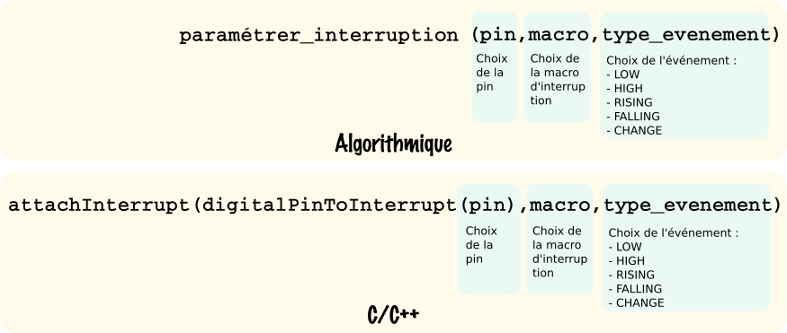

# Les interruptions en environnement Arduino

L'interruption, ou comment mettre en pause le programme principal pour pouvoir faire exécuter autre chose au microcontrôleur.

## 1. Ça sert à quoi une interruption ?

Une interruption peut se déclencher de plusieurs manières :

* Sur un événement interne : Fin  de comptage d'un timer, fin de décodage d'un CAN ...
* Sur un événement externe : Changement d'état d'une pin numérique.

Nous nous concentrerons dans cette partie aux interruptions déclenchées par un événement externe. Le comportement du microcontrôleur réagissant à un tel type d'interruption est le suivant.

1. Une pin numérique paramétrée en entrée sur laquelle a été programmée une interruption, change d'état (passage de 0 à 1 par exemple).
2. Le programme principal (```void loop()```) est immédiatement arrêté, sa position est mémorisée
3. Le microcontrôleur exécute la macro d'interruption définie au préalable.
4. Le microcontrôleur reprend le programme principal à l'endroit mémorisé.

!!! note
    Les interruptions sont très utilisées, le fait de pouvoir mettre en pause le programme principal même lorsque celui-ci exécute un ```delay()``` est très apprécié.


## 2. Paramétrage d'une interruption sur un événement externe

Le paramétrage de l'interruption se fait dans le ```void setup()``` en utilisant la fonction ```attachInterrupt()``` de cette manière :



!!! warning
    Toutes le pins ne peuvent pas être utilisées pour faire des interruptions, pour l'**Arduino MEGA se sont les pins : 2, 3, 18, 19, 20, 21** et pour l'**Arduino UNO les pins :  2 et 3**.

Ci-dessous un exemple de paramétrage d'interruption sur la pin numérique 2 d'un Arduino MEGA, le déclenchement est choisi sur front-montant (rising) :

```c++
void setup()
{
  pinMode(2,INPUT); //Déclaration de la pin 2 en entrée
  attachInterrupt(digitalPinToInterrupt(2),macro_interrupt,RISING); //Paramétrage d'une interruption sur la pin 2
}
```

## 3. Création de la macro d'interruption

La macro d'interruption est une macro **sans paramètres d'entrée ni de sortie**, celle-ci doit être la plus **courte possible**. En effet, afin de ne pas saturer la mémoire du microcontrôleur qui lors d'une interruption doit mémoriser les valeurs des variables dans le programme principal, votre macro d'interruption ne doit pas comporter d'instructions gourmandes en mémoire : appel de fonctions pour le port série, pour écrire sur un écran lcd ...

En général nous préconisons d'inverser l'état d'un booléen aussi appelé *flag* dans cette macro, il s’agira ensuite de regarder l'état de se flag dans le programme principal vérifiant si il y a eu, ou non une interruption. Les variables utilisées dans une macro d'interruption doivent **obligatoirement** être déclaré **globales** et comme **volatile**.

Nous donnons ci-dessous un exemple de création de macro d'interruption avec déclaration d'un flag, ainsi qu'un test sur ce flag dans le programme principal:

```c++
volatile boolean flag=false; //Déclaration du flag en volatile pour utilisation dans la macro d'interruption

void macro_interrupt(void) //Prototype de la macro d'interruption
{
  flag=!flag; //Inversion du flag
}

void setup()
{
  pinMode(2,INPUT);
  Serial.begin(9600);
  attachInterrupt(digitalPinToInterrupt(2),macro_interrupt,RISING);
}

void loop()
{
  if (!flag) //Test sur la variable  flag, si flag=0 => Pas d'interruption, si flag=1 => Il y a eu une interruption
  Serial.println("Il n'y a pas eu d'interruption"); //Affichage d'un message sur le serial si pas d'interruption
  else
  {
      Serial.println("Il y a eu une interruption"); //Affichage d'un message sur le serial si interruption
      flag=false; //remise à zéro du flag pour la prochaine interruption
  }  
}
```
