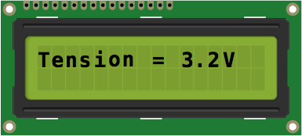

# Découverte du convertisseur analogique numérique

## Réalisation de l'activité

Pour cela vous devrez **impérativement** utiliser le squelette du programme Arduino donné ci-dessous :

``` c++

 /**************************************************************************************************
 Nom ......... : Clignotement_led_13.ino
 Role ........ : Fait clignoter la led reliée à la pin 13 d'une carte Arduino MEGA
 								 Cycle : 500ms OFF; 500ms ON
 Auteur ...... : Votre nom
 Classe ...... : Votre classe
 Etablissement : Lycée Louis Rascol, Albi, FRANCE <http://louis-rascol.entmip.fr/>
 Mail ........ : Votre_mail@e.rascol.net
 Version ..... : V0.0 du xx/xx/16
 Licence ..... : Copyright (C) 2016  Votre nom

                 This program is free software: you can redistribute it and/or modify
                 it under the terms of the GNU General Public License as published by
                 the Free Software Foundation, either version 3 of the License, or
                 (at your option) any later version.

                 This program is distributed in the hope that it will be useful,
                 but WITHOUT ANY WARRANTY; without even the implied warranty of
                 MERCHANTABILITY or FITNESS FOR A PARTICULAR PURPOSE.  See the
                 GNU General Public License for more details.

                 You should have received a copy of the GNU General Public License
                 along with this program.  If not, see <http://www.gnu.org/licenses/>

 Compilation . : Avec l'IDE Arduino
 ****************************************************************************************************/

 //Ajout de bibliothèques


 //Déclarations de constantes


 //Déclaration de variables


 void setup()
 {
	 //Insérez ici vos paramètres
 }

 void loop()
 {
   //Insérez ici votre programme principal
 }
```

Pour la suite vous pouvez télécharger un fichier zip squelette pré-rempli : [Télécharger](ressources/Squelette_Arduino_Rascol.zip)

**Marche à suivre :**

1. **Faire l'algorithme** du programme en utilisant la notation algorithmique normalisée.
2. Créer un fichier Arduino et y copier-coller le squelette.
3. Codez votre algorithme **ne soyez pas avare en commentaires**.
4. Téléversez sur la carte et **vérifiez le bon fonctionnement**.
5. Appelez le professeur pour valider.

!!! important
    La validation de l'exercice sera uniquement effectuée lors de la présentation d'un **algorithme juste** et d'un **code Arduino suffisamment commenté en fonctionnement**.

## 1. Fabrication d'un voltmètre

### 1.1 Affichage sur le moniteur série

Nous souhaitons utiliser le Serial (aussi appelé UART) d'une carte Arduino MEGA pour afficher la tension analogique de la pin A0 **au dixième prêt**. Nous ferons varier cette tension grâce au module Grove : **Rotary Sensor**. La figure ci-dessous montre l'affichage attendu sur le moniteur série :


### 1.2 Affichage sur un écran lcd

Nous souhaitons à présent conserver le même fonctionnement que précédemment, seulement l'affichage se fera sur un écran lcd : **Grove LCD RGB Backlight**. La figure ci-dessous montre l'affichage attendu sur l'écran LCD :



## 2. Affiche d'un niveau sous forme de jauge à essence


Dans cette partie tourner le **Grove Rotary Sensor** toujours connecté à l'entrée **A0** aura pour but de simuler le niveau d'essence d'un réservoir. Nous souhaitons ensuite avoir un affichage sur 4 leds de ce niveau, la variation du niveau d'essence (soit la tension sur A0) provoquera l'allumage ou l'extinction des 4 leds. Le comportement attendu est le suivant :

