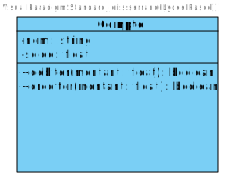
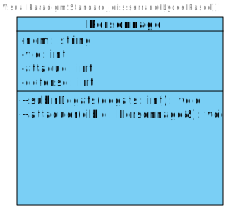

---
search:
  exclude: true
marp: true
style: |
  .columns {
    display: grid;
    grid-template-columns: repeat(2, minmax(0, 1fr));
    gap: 1rem;
  },
  section.lead h1 {
  text-align: center;
  font-size: 250%
  }

---
<!-- _backgroundImage: url("assets/bgImage.jpg") -->
# ▶︎ C11 - Classes et Objets
>## Programmation C++
>### BTS CIEL Informatique et Réseaux
>### Lycée Louis Rascol, Albi
<br><br>
`Release : v1.0 (23.09.23)`
📧 [joris.serrand@rascol.net](mailto:joris.serrand@rascol.net)
🖥️ Site Web : [ciel-ir-rascol.github.io](https://ciel-ir-rascol.github.io/)
🐙 GitHub : [ciel-ir-rascol](https://github.com/ciel-ir-rascol)


---
<!-- paginate: true --->
<!--
header: ▶︎ C11 - Classes et Objets
footer: Programmation C++ • Lycée Louis Rascol, Albi
-->

<!-- _class: lead -->
# Qu'est ce que l'OOP ?
# *Object-Oriented Programming*

---

# Le paradigme procédural

## ▶︎ La programmation procédurale (ce qu'on faisait jusqu'à présent)
- On se concentre sur les processus et les actions.
- Le programme est habituellement une collection de fonctions.
- Les données sont déclarées séparément des fonctions. 
- Les données sont passées comme arguments aux fonctions.
- Plus facile à apprendre, chaque tâche est divisée en sous-tâches : les fonctions.

---

# Les limitations de la programmation procédurale
- Les **fonctions ont besoin de connaître la structure des données**.
- Si le format des données change toutes les fonctions doivent être réadaptées.
- Plus le programme devient grand plus cela devient difficile voir impossible à faire 🤯
  - Difficultés à comprendre, maintenir, étendre, debugger, réutiliser
  - Plus facile à "casser" son programme

---

# Exemple de code en procédural
▶︎ Gestion de compte en banque 💶
```cpp
// Fonction permettant de retirer de l'argent
bool retirer(float* solde, float montant){
    if(*solde >= montant){
        *solde -= montant;
        return true;
    }
    else
        return false;
}

// Fonction permettant de créditer de l'argent
bool crediter(float* solde, float montant){
    *solde += montant;
    return true;
}
```

---
# Exemple de code en procédural
▶︎ Gestion de compte en banque 💶

```cpp
// Programme principal
int main(){
    string nomCompte {"SquirrelBank"};
    float solde{1679.22}, somme{0};

    cout << "Saisissez la somme à retirer : ";
    cin >> somme;
    
    if (retirer(&solde, somme))
        cout << "Somme retirée !";
    else
        cout << "Solde insuffisant !";
}

return 0;
```

---

# Exemple de code en procédural
▶︎ Gestion de compte en banque 💶

- Comment faire pour ajouter un compte en banque ?
- Comment faire pour ajouter des clients ?
- Pour ajouter des infos sur les clients (nom, prénom, numéro de tel) ?
- ...

🤯 **Trop de choses à modifier quand on modifie les données !**

---

# Et ça donnerait quoi en OOP ?

```cpp
class Compte{
private:
    string nom;
    int solde;
public:
    bool retirer(float montant){
        if(solde >= montant){
            solde -= montant;
            return true;
        }
        else
            return false;
    }
    bool crediter(float montant){
        solde += montant;
        return true;
    }
};
```


---

# Et ça donnerait quoi en OOP ?
- On se focalise sur des **entités du monde réel** : 
  - Classe `Compte` → Un compte en banque
  - Classe `Client` → Un client
- OOP = Modéliser son code en classe et objets
- `Compte` est modifiable :
  - Si on souhaite modifier/ajouter des attributs : `numeroCompte`, `nbMouvements` ...
  -  Si on souhaite ajouter des méthodes : `cloturer()`, `ajouterCB()` ...

**▶︎ En OOP il suffit de modifier la classe et tout s'adapte 👍**

---

# Notion d'encapsulation 📦

- C'est comme ça que les classes sont modélisées → Elles contiennent **des données et des méthodes qui interviennent sur ces données**.
- **OOP → Méthodes et Données sont encapsulées au même endroit**
- **Procédural → Les données sont transmises entre fonctions qui les passe et les retourne**
- Facilite grandement la réutilisation du code
- Possibilité d'utiliser des notions évoluées : Héritage, Polymorphisme

---

# Mais alors c'est quoi un objet ?
> *Depuis le début on parle que de classes, mais ils sont où les objets ??!! 🤨*

▶︎ **Un objet est l'instance d'un classe**
```cpp
int main(){
    
    // J’instancie la classe Compte
    Compte squirrelBank;

    return 0;
}
```
Ici, je viens de créer un objet `squirrelBank` de la classe `Compte` implémentée précédemment.

---

<!-- _class: lead -->
# Déclarer des classes
# Créer des objets

---

# Déclarer une classe

▶︎ Syntaxe  d'une déclaration de classe en C++ 
```cpp
class Nom_de_la_classe
{
    // déclarations;
};
```
‼️ Par convention, le nom d'une classe doit **toujours commencer par une majuscule**
‼️ Ne pas oublier le **point-virgule** `;` à la fin de la déclaration

---

# Exemple jeu de rôle 🧙
▶︎ Déclaration de la classe `Personnage`
```cpp
class Personnage{
    // Attributs
    string nom;
    int vie;
    int attaque;
    int defense;
    
    // Méthodes
    // Nous donnons dans cet ex, 
    // juste la déclaration des méthodes
    void subirDegats(int degats); 
    void attaquer(Personnage& cible);
};
```


---

# Exemple jeu de rôle 🧙
▶︎ Instanciation de la classe `Personnage`
```cpp
int main(){
    Personnage arthur; // Instanciation de Personnage en arthur
    Personnage merlin; // Instanciation de Personnage en merlin

    // Pointeur sur un objet dans le Heap
    Personnage* perceval = new Personnage();

    // Supression de l'objet dans le Heap
    delete perceval;
}
```

---

# Accéder aux attributs de la classe
▶︎ Pour les **objets** : Opérateur point : `.`
```cpp
// Modification du contenu d'un attribut
arthur.vie = 100;

// Appel de la méthode subirDégats()
arthur.subirDegats(10);
```
‼️ Par défaut les **attributs d'une classe sont privés**, il faut mettre les attributs en `public` si on veut y acceder, **mais ce n'est pas conseillé !**

---

# Accéder aux attributs de la classe
▶︎ Pour les **pointeurs sur des objets** : Opérateur flèche : `->`
```cpp
// Déclaration d'un pointeur sur un objet dans le Heap
Personnage* lancelot = new Personnage();

// Accès à l'attribut vie (s'il est public)
lancelot->vie = 95;

// Appel de la méthode attaquer() sur l'objet arthur
lancelot->attaquer(arthur);
```

---

# Public / Privé ?
▶︎ Modificateurs d'accès
- `public` : Ressources accessibles depuis n'importe où
- `private` : Accessible uniquement par les membres ou les amis de la classe
- `protected` : Utilisé avec l'héritage (on le verra plus tard...)

---

# Public / Privé ?
▶︎ Exemple avec la classe `Personnage`
```cpp
class Personnage{
// Attributs en private
private:
    string nom;
    int vie;
    int attaque;
    int defense;
    
// Méthodes en public
public:
    // Nous donnons dans cet ex, juste la déclaration des méthodes
    void subirDegats(int degats); 
    void attaquer(Personnage& cible);
};
```

---

<!-- _class: lead -->
# Implémenter des Méthodes

---

# Techniques d'implémentation
- Les méthodes ont **accès aux attributs** de la classe (pas nécessaire de les passer en arguments comme les fonctions)
- Une méthode peut être implémentée à l'**intérieur** de la déclaration de la classe, **mais aussi en dehors**.
  - Utilisation du *scope resolution operator* : `Nom_classe::nom_methode`
- On peut séparer la déclaration (aussi appelé spécification) de la classe de son implémentation (contenu) :
  - Fichier .h pour la déclaration
  - Fichier .cpp pour l'implémentation

---

# Implémentation de méthodes dans la classe
▶︎ Exemple d'implémentation avec la classe `Personnage`
<div class="columns">
<div>

```cpp
class Personnage{
private:
    string nom;
    int vie;
    int attaque;
    int defense;

public:
    // Méthode subirDegats()
    // Déclaration + Implémentation
    void subirDegats(int degats) { 
        int degatsInfliges = degats - defense;
        if (degatsInfliges > 0) {
            vie -= degatsInfliges;
        }
    }
};
```
</div>

<div>

Ici `subirDegats()` permet de diminuer la `vie` du personnage si `degats-defense > 0`

`subirDegats()` a librement accès à `vie` et à `defense`

ℹ️ **Les méthodes ont accès aux attributs car elles sont membres de la classe.**

</div>
</div>

---

# Implémentation de méthodes en dehors de la classe
▶︎ Implémentation, toujours avec la classe `Personnage`

<div class="columns">
<div>

```cpp
class Personnage{
private:
    string nom;
    int vie;
    int attaque;
    int defense;

public:
    // Déclaration Méthode subirDegats()
    void subirDegats(int degats);
};
```    
</div>
<div>

```cpp    
// Dans le même fichier .cpp
// Implémentation en dehors de la classe

void Personnage::subirDegats(int degats) { 
    int degatsInfliges = degats - defense;
    if (degatsInfliges > 0) {
        vie -= degatsInfliges;
    }
}
```
ℹ️ On utilise le ***scope resolution operator*** `::` pour **spécifier la classe de la méthode**
</div>
</div>

---

# Déclaration et implémentation, fichiers séparés
▶︎ Fichier `Personnage.h`

<div class="columns">
<div>

```cpp
#ifndef PERSONNAGE_H // Include Guard
#define PERSONNAGE_H

class Personnage{
private:
    string nom;
    int vie;
    int attaque;
    int defense;

public:
    // Déclaration Méthode subirDegats()
    void subirDegats(int degats);
};

#endif // PERSONNAGE_H
```    
</div>
<div>

> 🤨 Mais à quoi servent les 2 premieres lignes ??!!

▶︎ C'est l'***Include Guard*, indispensable** ! Si ce fichier est inclus dans plus d'un fichier .cpp alors le compilateur verra la déclaration de la classe `Personnage` plus d'une fois et **lèvera une erreur pour des déclarations dupliquées**.
</div>
</div>

---

# Déclaration et implémentation, fichiers séparés
▶︎ Fichier `Personnage.cpp`
```cpp
#include "Personnage.h" // Inclusion du Header File

void Personnage::subirDegats(int degats) { 
    int degatsInfliges = degats - defense;
    if (degatsInfliges > 0) {
        vie -= degatsInfliges;
    }
}
```
⚠️ Il y a une Différence entre `#include <patati>` et `#include "patati.h"`, en effet dans le premier cas on cherche à **inclure des *systems headers files***, dans le second on cherche à **inclure des *headers files* du projet.**

---

# Déclaration et implémentation, fichiers séparés
▶︎ Fichier programme principal `main.cpp`
```cpp
#include "Personnage.h" // Include Header File classe Personnage

int main(){
    Personnage merlin; // Instanciation de la classe Personnage
    
    ...
    
    return 0;
}
```
‼️ Dans le fichier .cpp du programme principal, **il faut toujours inclure les headers files**, ici : `Personnage.h` et **jamais les .cpp**, `Personnage.cpp`.
