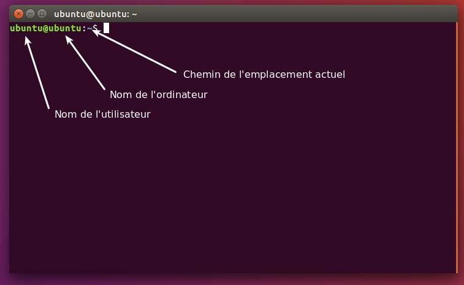

# Utiliser le terminal

## 1 - Le système de fichiers UNIX

L'agencement d'un système GNU/Linux n'est pas du tout le même que celui que l'on a sur Windows, nous ne trouverons pas par exemple la racine du système à l'emplacement ```C:\\```.


Le tableau ci-dessous donne les principaux dossiers de l'arborescence suivis de leur utilisation :

|Dossier|Utilisation|
|---|---|
|```/```|Racine du système équivalent du ```C:\\``` chez Windows|
|```/bin```|Applications fournies par le système tels que ```ls```, ```cd```, ```pwd```|
|```/dev```|Fichiers assurant la liaison avec les périphériques (disques, clés usb...)|
|```/etc```|Fichiers de paramétrage du système|
|```/home```|Répertoire personnel|
|```/proc```|Informations sur les processus et le noyau Linux|
|```/root```|Répertoire du super-utilisateur|
|```/tmp```|Fichiers temporaires|
|```/sbin```|Fichiers binaires du système|
|```/usr```|Fichiers binaires et commandes utilisateur|
|```/lib```|Bibliothèque système partagée|
|```/media```|Point de montage des périphériques de stockage connectés au système|
|```/mnt```|Point de montage temporaire des partitions et périphériques|
|```/var```|Systèmes de fichiers variables, comme le contenu web (dossier www), mais aussi les logs|
|```/boot```|Fichiers de démarage du système|

## 2 - Découverte du prompt

Le prompt est l'invite de commande qui attend calmement que vous lui demandiez d'effectuer quelque chose en tapant votre commande puis en validant avec la touche entrée. Ci-dessous une petite explication :



## 3 - Utilisation du manuel

Tout système UNIX dispose d'un manuel intégré à la console, il permet de faire une recherche détaillée sur l'utilisation d'une commande. Nous pouvons accéder à ce manuel en tapant : ```man``` suivi du nom de la fonction pour laquelle on a besoin d'aide. La sortie se fait en tapant ```q```. Dans la suite du TP, vous devrez vous servir au maximum du manuel avant de demander de l'aide.
Ci-dessous un exemple du manuel avec la fonction ```ls``` :


## 4 - Se déplacer dans l'arborescence

### Lister le contenu d'un répertoire (fichiers et dossiers)

!!! snippet
    `$ ls`


Avec un affichage des fichiers cachés :

!!! snippet
    `$ ls -a`


!!! info
    En environnement GNU/Linux pour cacher un fichier ou un dossier, il suffit de mettre un point, devant son nom.


<script type="text/javascript" src="https://asciinema.org/a/VoPokxkkh2iETLvZgpTDwNlVO.js" id="asciicast-VoPokxkkh2iETLvZgpTDwNlVO" async></script>

Dans cet exemple nous montrons la différence entre les commandes `ls` et `ls -a`, les fichiers ou dossiers ```.config``` ```.gnupg``` ou encore ```.profile``` sont cachés.

### Se déplacer d'un répertoire à un autre

!!! snippet
    `$ cd [chemin_du_répertoire]`

Ci-dessous nous nous déplaçons vers le répertoire ```/home/osboxes/Desktop``` :

<script type="text/javascript" src="https://asciinema.org/a/CDSOSI8eEYwEsWaeuLFVMYfaG.js" id="asciicast-CDSOSI8eEYwEsWaeuLFVMYfaG" async></script>

Vous pouvez remarquer dans le prompt le chemin qui change de ```~``` vers ```~/Desktop```

!!! info
    Le symbole `~` dit tilde dans un système GNU/Linux représente le home de l'utilisateur, dans le cas de la vidéo ci-dessus l'utilisateur s'appelant `osboxes`, le chemin complet de son    home est : `/home/osboxes/`


### Visualiser le chemin du répertoire courant

!!! snippet
    `$ pwd`


Dans l'exemple ci-dessous nous montrons le chemin courant soit `~`

<script type="text/javascript" src="https://asciinema.org/a/xum77NOg3VCXgZRJ93KEIYhup.js" id="asciicast-xum77NOg3VCXgZRJ93KEIYhup" async></script>

## 5 - Utiliser un éditeur de texte en ligne de commande

Plusieurs éditeurs de texte en ligne de commande existent sous environnement GNU/Linux, parmi eux nous pouvons citer les très connus **vim** et **emacs**, la courbe d'apprentissage des ces deux derniers étant très pentue nous préférons débuter avec l'éditeur **nano** installé par défaut sur les distributions Ubuntu.

Quelques commandes permettant de commencer avec nano :

* Pour ouvrir l'éditeur de texte
!!! snippet
    `$ nano`


* Pour ouvrir un fichier, si le fichier n'existe pas nano le crée après confirmation d'enregistrement
!!! snippet
    `$ nano [nom_du_fichier]`


!!! warning
    Les noms de fichiers ne doivent pas comporter d'espaces, ceux-ci sont en général remplacés par l'underscore noté `_` .


L'exemple ci-dessous montre la création d'un nouveau fichier avec nano appelé : `test_nano`
<script type="text/javascript" src="https://asciinema.org/a/dLSdrHfEJ982JcztE2Hx7ggv6.js" id="asciicast-dLSdrHfEJ982JcztE2Hx7ggv6" async></script>

!!! info
    Nano propose une liste de fonctions accessibles par raccourcis clavier (voir barre en bas de l'écran de nano), le `^` est à remplacer par la touche **Ctrl**

    - Par exemple **Ctrl-g** pour avoir une aide sur les fonctions de nano.

    - **Ctrl-x** pour quitter nano, avant toute chose l'éditeur vous demande `Save modified buffer (ANSWERING 'No' WILL DESTROY CHANGES) ?` tapper `y` enregistrera votre travail, tapper `n` le supprimera. Puis nano demande     `File Name to Write: ` rentrez ici le nom que vous souhaitez donner à votre fichier si il n'existe pas déjà.


## 6 - Créer un dossier ou répertoire

!!! snippet
    `$ mkdir [nom_du_dossier]`


La fonction `mkdir` suivie d'un nom crée un dossier dans le répertoire où vous vous trouvez. Nous créons ci-dessous un dossier appelé `sti2d_sin` dans le répertoire `~/Documents`.

<script type="text/javascript" src="https://asciinema.org/a/9QrSoldY0Mm3E9eKdDJM96ixU.js" id="asciicast-9QrSoldY0Mm3E9eKdDJM96ixU" async></script>

## 7 - Supprimer un fichier ou un dossier

Dans le cas d'un fichier :

!!! snippet
    `$ rm [chemin_du_fichier]`


Dans le cas d'un dossier :

!!! snippet
    `$ rm -rf [chemin_du_dossier]`

!!! info
    Le fait de rajouter l'option `r` (récursivité) à la commande `rm` va supprimer tous les fichiers contenus dans le dossier puis le dossier lui même, l'option `f` va forcer la suppression    même si le dossier est plein.


L'exemple ci-dessous montre la suppression d'un fichier `test` puis du dossier qui le contenait `sti2d_sin`.

<script type="text/javascript" src="https://asciinema.org/a/foIPfvFwwcu9TKXJPQLgMoZXt.js" id="asciicast-foIPfvFwwcu9TKXJPQLgMoZXt" async></script>

!!! info
    La fonction `tree` permet d'afficher l'arborescence du répertoire actuel, elle     n'est pas installée d'origine dans la distribution, pour ce faire tappez : `sudo apt install tree`


## 8 - Copier des fichiers ou des dossiers

Dans le cas d'un fichier :

!!! snippet
    `$ cp [chemin_du_fichier_à_copier] [répertoire_de_destination]/`


Dans le cas d'un dossier :

!!! snippet
    `$ cp -r [chemin_du_dossier_à_copier] [répertoire_de_destination]/`


<script type="text/javascript" src="https://asciinema.org/a/gMLxJ9uZoJCXUmBHIG4prtnuD.js" id="asciicast-gMLxJ9uZoJCXUmBHIG4prtnuD" async></script>

## 9 - Déplacement et renommage

### Renommer des fichiers ou des dossiers

Se déplacer dans le répertoire où se situe le fichier ou le dossier à renommer puis tappez la commande :

!!! snippet
    `$ mv [nom_actuel] [nouveau_nom]`


Dans l'exemple suivant nous renommons le dossier `sti2d_sin` en `sti2d_itec`

<script type="text/javascript" src="https://asciinema.org/a/mOo6X499hwgkHTa9BzQQUFY9L.js" id="asciicast-mOo6X499hwgkHTa9BzQQUFY9L" async></script>

### Déplacer des fichiers ou des dossiers

!!! snippet
    `$ mv [chemin_du_dossier_ou_fichier_a_deplacer] [destination]/`


Ci-dessous nous déplaçons le dossier `~/Documents/sti2d_itec` dans le dossier `~/Desktop` :

<script type="text/javascript" src="https://asciinema.org/a/YNxYwF58gqaTIVZCNQtzUCpg4.js" id="asciicast-YNxYwF58gqaTIVZCNQtzUCpg4" async></script>
